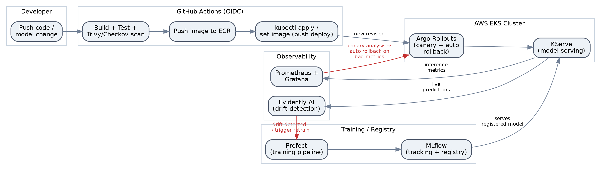
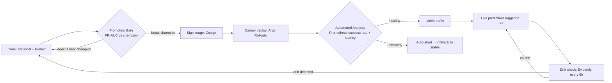
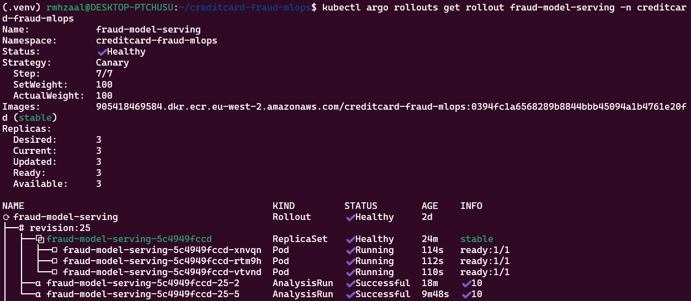
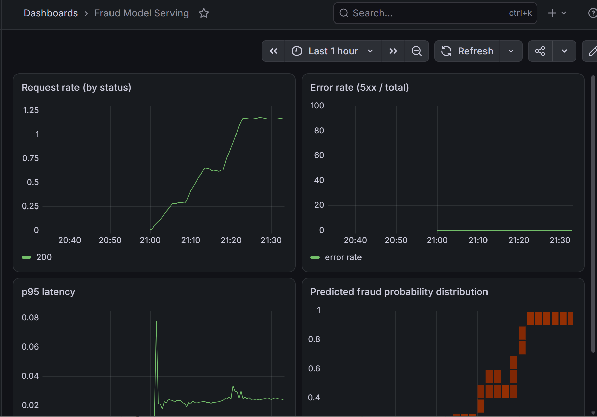
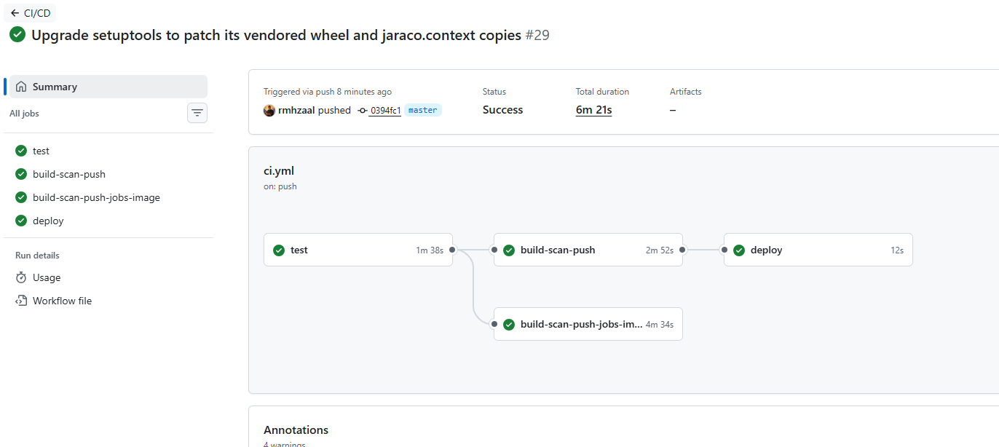
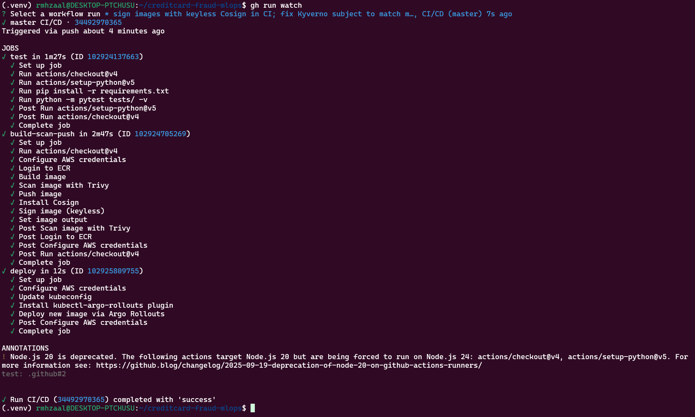
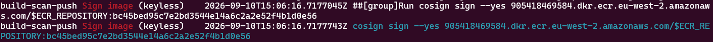

# Closed Loop MLOps: Fraud Detection Platform on AWS EKS

[](https://github.com/rmhzaal/creditcard-fraud-mlops/actions/workflows/ci.yml)


A fraud detection platform that doesn't stop at "model behind an API." It watches its own predictions in production, detects when the data it sees has drifted from what it was trained on, retrains itself automatically, and refuses to let a bad deployment reach real traffic without a human touching anything. All the pieces, for example infrastructure, training, deployment, security, monitoring runs against real AWS resources, provisioned and shipped through the same CI/CD pipeline.



## 🧠 Why "Closed Loop"

Most fraud/ML demos end at deployment. This one treats deployment as the midpoint, not the finish line.



Training, promotion, signing, canary analysis, drift detection, and retraining are one pipeline, not separate demos stitched together. The same promotion gate governs a model whether a human triggered the run or the drift CronJob did.

## 📊 Proven In Production, Not Just Diagrammed

Below is something I triggered and watched happen against the real cluster:

| Test | What I did | What happened |
|---|---|---|
| Automated rollback | Flipped a `SIMULATE_FAILURE` flag on a live canary and sent it real traffic | Argo Rollouts' analysis counted 3 failed checks against a limit of 2, aborted the rollout, and restored 100% traffic to the last healthy revision in under 4 minutes — no human intervention |
| Drift-triggered retraining | Let 40 live predictions accumulate that looked nothing like the training distribution | Drift check computed a drift share of 1.00 against a 0.3 threshold, auto-triggered `src.flows`, and the retrain scored PR-AUC 0.8464 vs. the champion's 0.8474 — correctly **not promoted** |
| Image signing | Verified end-to-end Cosign keyless signing | Real Rekor transparency-log entry created, `tlog entry created with index: 2784412024` |
| Signature enforcement | Tried deploying an unsigned image and a `:latest`-tagged image into the cluster | Both denied by Kyverno, citing `disallow-latest-tag` and `verify-image-signature` by name |
| Policy catching a real bug | Turned on `:latest` tag enforcement | MLflow's own deployment had been silently running `ghcr.io/mlflow/mlflow:latest` since early in the build — enforcement broke its ability to recreate its pod, a genuine outage, diagnosed with `kubectl describe`/events and fixed by pinning to a verified release, `ghcr.io/mlflow/mlflow:v3.16.0` |
| Secrets migration | Moved the MLflow DB password from a manually-created Secret to External Secrets Operator syncing from AWS Secrets Manager | `ExternalSecret` reported `SecretSynced` / `READY: True`, synced value byte-identical to the original, zero MLflow downtime from the migration itself |
| Healthy canary baseline | Ran multiple full rollouts before the chaos test | Two-for-two passing `AnalysisRun`s (10/10 checks, twice) |

<p align="center">
  
  <br/>
  <em><code>fraud-model-serving</code>, revision 25 canary fully promoted to 100% traffic, all 3 pods healthy, 2 <code>AnalysisRun</code>s passing.</em>
</p>

## 🧰 What's Actually Running

| Layer | Tech |
|---|---|
| Training | Python, XGBoost, scikit-learn, orchestrated with Prefect |
| Experiment tracking / registry | MLflow, with a `champion` alias promotion gate |
| Data versioning | DVC, backed by S3 |
| Serving | FastAPI, instrumented with Prometheus metrics |
| Infrastructure | AWS EKS, RDS (Postgres), S3, ECR, Secrets Manager — all provisioned with Terraform |
| Deployment | Argo Rollouts (canary: 10% → analysis → 50% → analysis → 100%) |
| CI/CD | GitHub Actions, OIDC federation (no long-lived AWS keys) |
| Supply chain security | Trivy (vulnerability scanning), Cosign (keyless signing) |
| Policy enforcement | Kyverno (tag pinning + signature verification) |
| Secrets | External Secrets Operator ← AWS Secrets Manager |
| Drift detection | Evidently AI, running as a Kubernetes CronJob every 6 hours |
| Observability | Prometheus + Grafana |

## 🔒 Security & Secrets Management

Two Kyverno `ClusterPolicy` resources sit in front of every pod in the cluster. The first rejects anything running a floating `:latest` tag this is the policy that caught MLflow's own deployment quietly running an unpinned image, described below.

```yaml
apiVersion: kyverno.io/v1
kind: ClusterPolicy
metadata:
  name: disallow-latest-tag
spec:
  validationFailureAction: Enforce
  rules:
    - name: require-image-tag
      match:
        any:
          - resources:
              kinds: ["Pod"]
      validate:
        message: "Images must not use the :latest tag."
        pattern:
          spec:
            containers:
              - image: "!*:latest"
```

The second verifies that every image from this project's ECR repository carries a valid keyless Cosign signature, tied specifically to this repo's own GitHub Actions workflow identity no public key to manage or rotate.

```yaml
apiVersion: kyverno.io/v1
kind: ClusterPolicy
metadata:
  name: verify-image-signature
spec:
  validationFailureAction: Enforce
  rules:
    - name: verify-signature
      match:
        any:
          - resources:
              kinds: ["Pod"]
              namespaces: ["creditcard-fraud-mlops"]
      verifyImages:
        - imageReferences:
            - "*.dkr.ecr.eu-west-2.amazonaws.com/creditcard-fraud-mlops*"
          attestors:
            - entries:
                - keyless:
                    subject: "https://github.com/rmhzaal/creditcard-fraud-mlops/.github/workflows/ci.yml@refs/heads/main"
                    issuer: "https://token.actions.githubusercontent.com"
```

The MLflow database password never touches a manual `kubectl create secret` command. External Secrets Operator pulls it straight from AWS Secrets Manager and keeps it in sync.

```yaml
apiVersion: external-secrets.io/v1beta1
kind: SecretStore
metadata:
  name: aws-secrets-manager
spec:
  provider:
    aws:
      service: SecretsManager
      region: eu-west-2
---
apiVersion: external-secrets.io/v1beta1
kind: ExternalSecret
metadata:
  name: mlflow-db
spec:
  refreshInterval: 1h
  secretStoreRef:
    name: aws-secrets-manager
    kind: SecretStore
  target:
    name: mlflow-db
  data:
    - secretKey: password
      remoteRef:
        key: <secrets-manager-secret-name>   # terraform output mlflow_db_secret_name
```

Both `ClusterPolicy` resources and the `ExternalSecret` live under `k8s/kyverno-policies.yaml` and `k8s/external-secret.yaml` in this repo, in full.

## 📈 Observability

Prometheus scrapes the FastAPI serving layer; Grafana visualizes request rate, error rate, p95 latency, and the live distribution of predicted fraud probabilities side by side, so a bad deploy or a drifting model shows up visually before it shows up in a ticket.

<p align="center">
  
</p>

## 🎯 Deployment Verification

If you're browsing this repo and want to check yourself, these are real commands against the live cluster:

```bash
# See the canary rollout in progress, step by step
kubectl argo rollouts get rollout fraud-detection -n creditcard-fraud-mlops --watch

# See the automated analysis results Argo Rollouts used to make its call
kubectl get analysisrun -n creditcard-fraud-mlops

# Confirm the signature verification policy, scoped to this repo's own CI identity
kubectl describe clusterpolicy verify-image-signature

# Confirm the MLflow DB password is synced from Secrets Manager, not stored in-cluster
kubectl get externalsecret -n creditcard-fraud-mlops

# See the drift-check schedule
kubectl get cronjob -n creditcard-fraud-mlops
```

The full CI/CD pipeline test, Trivy scan, Cosign sign, deploy is in `.github/workflows/ci.yml`. The Rekor transparency log entry at index `2784412024` is public and independently verifiable proof that this pipeline's own identity signed the image it deployed.

<p align="center">
  
  <br/>
  <em>A complete <code>test → build-scan-push → deploy</code> run, green end to end.</em>
</p>

<p align="center">
  
  <br/>
  <em>Step-level detail from the same pipeline. Trivy scan and Cosign keyless signing running inside <code>build-scan-push</code>.</em>
</p>

<p align="center">
  
  <br/>
  <em><code>cosign sign --yes</code> running against the freshly-pushed ECR image, the step that produces the Rekor transparency log entry above.</em>
</p>

## ☁️ Infrastructure At A Glance

All infrastructure is provisioned through Terraform in `terraform/` — nothing here was clicked together manually.

- VPC with public/private subnets in `eu-west-2`
- EKS cluster: `creditcard-fraud-mlops-cluster`
- RDS Postgres, used as the MLflow backend store
- Two S3 buckets: `mlflow-artifacts`, `dvc-store`
- ECR repository: `creditcard-fraud-mlops`
- GitHub OIDC federation role, scoped to this repo, for keyless CI auth
- AWS Secrets Manager, holding the MLflow DB password
- Least-privilege node IAM policies (`node_mlflow_s3`, `node_dvc_s3_read`, `node_secrets`)

AWS account ID and other environment-specific values are redacted throughout (`<account-id>`) — swap in your own if you deploy this yourself.

## 📁 Repository Layout

```
.
├── .github/workflows/     # CI/CD: test, scan, sign, deploy
├── data/raw/              # DVC-tracked raw dataset
├── docs/                  # architecture.png, grafana-dashboard.json, screenshots/
├── k8s/                   # rollout, analysis template, drift CronJob,
├── serving/               # FastAPI app: /predict, /health, /metrics
├── src/                   # training, Prefect flow, drift_check.py
├── terraform/             # VPC, EKS, RDS, S3, ECR, Secrets Manager, OIDC
├── tests/
├── Dockerfile             # serving image
├── Dockerfile.jobs        # training / drift-check job image
└── requirements.txt
```

---

Built end-to-end as a portfolio project to prove out a genuinely closed-loop MLOps system, not just a deployed model. Every result cited above came from running it against real infrastructure and watching it happen.
